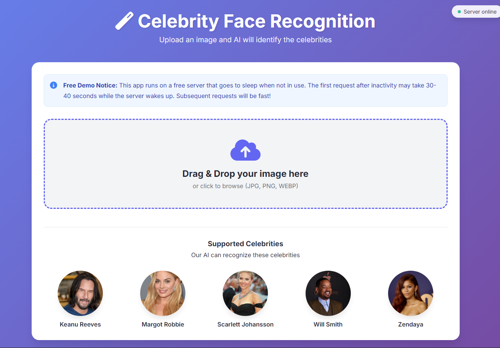

# 🎭 Celebrity Face Recognition

An AI-powered web application that identifies celebrities in images using machine learning. Built with Flask, OpenCV, scikit-learn, and modern web technologies, it can detect multiple faces in a single image and provide confidence scores for each prediction.


## ✨ Features

- **Multi-Face Detection**: Identifies multiple celebrities in a single image
- **High Accuracy**: Uses wavelet transforms and machine learning for accurate predictions
- **Real-time Processing**: Get instant results with confidence scores
- **Smart Image Handling**: Automatic image resizing and optimization
- **Modern UI**: Clean, responsive design with smooth animations
- **Celebrity Support**: Currently recognizes:
  - Keanu Reeves
  - Margot Robbie
  - Scarlett Johansson
  - Will Smith
  - Zendaya

## 🚀 Live Demo

- **App**: [https://celeb-detect.netlify.app/](https://celeb-detect.netlify.app/)
- **API**: [https://celeb-face-rec-backend.onrender.com](https://celeb-face-rec-backend.onrender.com)

> **Note**: The backend runs on a free server that may take 30-40 seconds to wake up on first visit. Subsequent requests will be fast!

## 📸 Screenshots

<details>
<summary>Click to view screenshots</summary>

### Home Page


### Recognition Results


</details>

## 🛠️ Tech Stack

### Backend
- **Flask** - Web framework
- **OpenCV** - Face detection and image processing
- **scikit-learn** - Machine learning classification
- **PyWavelets** - Wavelet transformations for feature extraction
- **NumPy** - Numerical computations
- **Gunicorn** - Production WSGI server

### Frontend
- **HTML5** & **CSS3** - Modern, responsive design
- **JavaScript (ES6)** - Dynamic interactions
- **Font Awesome** - Icons
- **Google Fonts** - Typography

### Deployment
- **Frontend**: Netlify
- **Backend**: Render (Free tier with auto-sleep)

## 📊 Model Information

The machine learning model uses:
- **Feature Extraction**: Haar Cascades for face detection + Wavelet transforms
- **Algorithm**: Support Vector Machine (SVM) / Logistic Regression
- **Training Data**: Celebrity face images with 2-eye detection validation
- **Input Processing**: 
  - Face detection with eye validation
  - Image resizing to 32x32
  - Wavelet transformation
  - Feature concatenation

## 🏃‍♂️ Running Locally

### Prerequisites
- Python 3.8+
- pip package manager
- OpenCV Haar Cascade files (included in the repo)

### Local Deployment

1. **Clone the repository**
   ```bash
   git clone https://github.com/pranavpatel08/Celebrity-Face-Detection
   cd Celebrity-Face-Detection
   ```

2. **Set up the backend**
   ```bash
   cd server
   pip install -r requirements.txt
   ```

3. **Run the Flask server**
   ```bash
   python server.py
   ```
   The API will be available at `http://localhost:5000`

5. **Run the frontend** (in a new terminal)
   ```bash
   cd client
   python -m http.server 8000
   ```
   Open `http://localhost:8000` in your browser

## 📁 Project Structure

```
celebrity-face-recognition/
├── client/                       # Frontend application
│   ├── index.html                 # Main HTML file
│   ├── app.css                    # Styles
│   ├── app.js                     # JavaScript
│   └── images/                    # Celebrity preview images
│
├── server/                       # Backend application
│   ├── server.py                  # Flask application
│   ├── util.py                    # Utility functions
│   ├── wavelet.py                 # Wavelet transformation
│   ├── requirements.txt           # Python dependencies
│   ├── artifacts/                 # ML model files
│   │   ├── saved_model.pkl         # Trained model
│   │   └── class_dictionary.json   # Celebrity classes
│   └── opencv/haarcascades/        # Face detection files
|
├── model/                        # modle files
│   ├── celebreity_face_detection.ipynb  # Model training notebook
│   ├── saved_model.pkl             # Trained model
│   ├── class_dictionary.json       # Celebrity classes
│   ├── test_images/                # Celebrity test images
│   ├── dataset/                    # Dataset used for training (manually collected)
│   └── opencv/haarcascades/        # Face detection files
|
└── README.md                     # Project documentation
```

## 🔌 API Endpoints

### Base URL: `https://celeb-face-rec-backend.onrender.com`

| Endpoint | Method | Description |
|----------|--------|-------------|
| `/` | GET | API welcome message |
| `/health` | GET | Server health check |
| `/classify_image` | POST | Classify faces in image |
| `/test_classify_image` | POST | Test model  |

### Example API Usage

```javascript
// Classify an image
const formData = new FormData();
formData.append('image_data', base64ImageData);

fetch('https://celeb-face-rec-backend.onrender.com/classify_image', {
    method: 'POST',
    body: formData
})
.then(response => response.json())
.then(data => {
    console.log(`Detected ${data.faces_detected} face(s)`);
    data.results.forEach((result, index) => {
        console.log(`Face ${index + 1}: ${result.predicted_class} (${result.top_predictions[0].probability}%)`);
    });
});
```

### Response Format

```json
{
    "faces_detected": 2,
    "results": [
        {
            "all_probabilities": [
                1.69,
                0.23,
                0.95,
                62.48,
                34.64
            ],
            "class_dictionary": {
                "keanu_reeves": 0,
                "margot_robbie": 1,
                "scarlett_johansson": 2,
                "will_smith": 3,
                "zendaya": 4
            },
            "face_index": 0,
            "predicted_class": "will_smith",
            "top_predictions": [
                {
                    "name": "will_smith",
                    "probability": 62.48
                },
                {
                    "name": "zendaya",
                    "probability": 34.64
                },
                {
                    "name": "keanu_reeves",
                    "probability": 1.69
                }
            ]
        },
        {
            "all_probabilities": [
                0.05,
                35.8,
                35.05,
                29.09,
                0.01
            ],
            "class_dictionary": {
                "keanu_reeves": 0,
                "margot_robbie": 1,
                "scarlett_johansson": 2,
                "will_smith": 3,
                "zendaya": 4
            },
            "face_index": 1,
            "predicted_class": "margot_robbie",
            "top_predictions": [
                {
                    "name": "margot_robbie",
                    "probability": 35.8
                },
                {
                    "name": "scarlett_johansson",
                    "probability": 35.05
                },
                {
                    "name": "will_smith",
                    "probability": 29.09
                }
            ]
        }
    ],
    "success": true
}
```

## 🔧 Configuration

### Adding New Celebrities

1. **Collect training images** for the new celebrity
2. **Retrain the model** with updated dataset
3. **Update `class_dictionary.json`**:
   ```json
   {
        "keanu_reeves": 0,
        "margot_robbie": 1,
        "scarlett_johansson": 2, 
        "will_smith": 3, 
        "zendaya": 4,
        "new_celebrity": 5
   }
   ```
4. **Add preview image** to `client/images/`
5. **Update frontend** celebrity list

### Model Improvements

- Increase training data per celebrity
- Use data augmentation techniques
- Experiment with different ML algorithms
- Fine-tune hyperparameters

## 🐛 Troubleshooting

### Common Issues

1. **"Server is waking up" message**
   - This is normal for free Render hosting
   - Wait 30-40 seconds for the server to start
   - Use the "Skip waiting" button if server is already up

2. **"No faces detected" error**
   - Ensure image has clear, front-facing faces
   - Check image quality and lighting
   - Verify both eyes are visible

3. **Model not loading on Render**
   - Verify file paths are correct
   - Check Render logs for detailed errors

4. **CORS errors**
   - Ensure backend URL is correct in frontend
   - Check that flask-cors is installed

## 🤝 Contributing

Contributions are welcome! Please feel free to submit a Pull Request.

1. Fork the repository
2. Create your feature branch (`git checkout -b feature/AmazingFeature`)
3. Commit your changes (`git commit -m 'Add some AmazingFeature'`)
4. Push to the branch (`git push origin feature/AmazingFeature`)
5. Open a Pull Request

### Areas for Contribution

- Add more celebrity faces
- Improve model accuracy
- Enhance UI/UX design
- Add face similarity features
- Implement batch processing
- Create mobile app

## 👏 Acknowledgments

- Fatkun for batch downloading images for dataset
- OpenCV for face detection capabilities
- scikit-learn for machine learning tools
- Render for free hosting solution